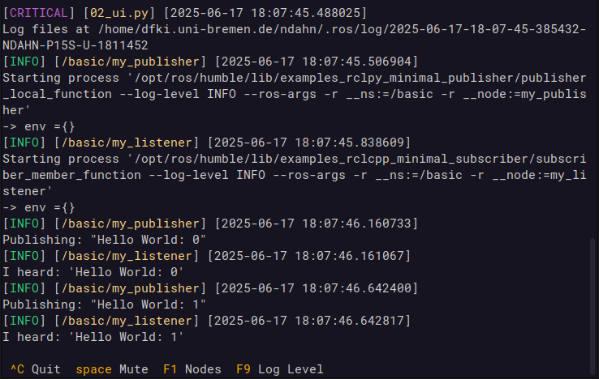
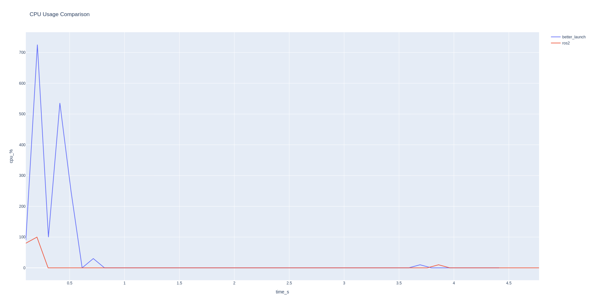
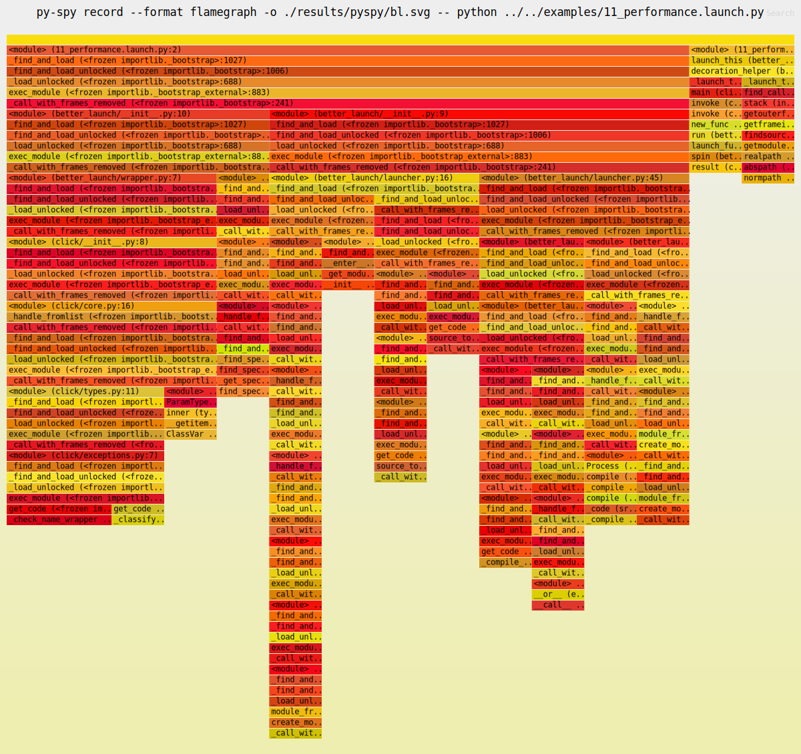

[About](#about) | [Why?](#why-not-improve-the-existing-ros2-launch) | [Features](#okay-what-can-i-do-with-it) | [Usage](#how-do-i-use-it) | [TUI](#the-tui) | [Differences](#what-are-the-differences) | [Performance](#performance) | [Installation](#installation) | [ROS2](#whats-so-bad-about-ros2-launch) | [Contributors](#contributors)

-> [Just looking for the documentation?](https://dfki-ric.github.io/better_launch/)

# 🚀 About
Let's face it: ROS2 has been a severe downgrade in terms of usability compared to ROS1. While there are many considerable improvements, the current launch system is borderline unusable. I've listed my personal gripes below, but if you're here you likely feel the same. This is why I wrote ***better_launch***.

Instead of dozens of imports and class instances for even the most basic tasks, your launch files could look as simple and beautiful as this:

```python
from better_launch import BetterLaunch, launch_this

@launch_this(ui=True)
def my_main(enable_x: bool = True):
    """
    This is how nice your launch files could be!
    """
    bl = BetterLaunch()

    if enable_x:
        bl.node(
            "examples_rclpy_minimal_publisher",
            "publisher_local_function",
            "example_publisher",
        )

    # Include other launch files, even regular ROS2 launch files!
    bl.include("better_launch", "ros2_turtlesim.launch.py")
```

```bash
$> bl my_package my_launch_file.py --enable_x True
```

*Do I have your attention? Read on to learn more!*


# 🤔 Why not improve the existing ROS2 launch?
Because I think it is beyond redemption and no amount of refactoring and REPs (ROS enhancement proposals) will turn the sails. Tools like the highly rated [simple_launch](https://github.com/oKermorgant/simple_launch) or [launch-generator](https://github.com/Tacha-S/launch_generator/) exist, but still use ROS2 launch under the hood and so inherit much of its clunkiness. Rather than fixing an inherently broken solution, I decided to make a RAP - a ROS abandonment proposal :)

Essentially, *better_launch* is what I wish ROS2 launch would be: intuitive to use, simple to understand, easy to remember. This is why *better_launch* is **not** yet another abstraction layer over ROS2 launch; it is a **full replacement** with no required dependencies on the existing launch system.


# 🧩 Okay, what can I do with it?
Everything you would expect and a little more! The `BetterLaunch` instance allows you to
- create *subscribers*, *publishers*, *services*, *service clients*, *action servers* and *action clients* on the fly
- start and stop *nodes*
- start and stop *lifecycle nodes* and manage their lifecycle stage
- start and stop *composers* and load *components* into them
- organize your nodes in *groups*
- define hasslefree *topic remaps* for nodes and groups
- *pass any arguments* from the command line without having to declare them
- easily *load parameters* from yaml files
- *locate files* based on filenames and package names
- use *string substitutions* to resolve e.g. paths
- include other *better_launch launch files*
- include other *ROS2 launch files*
- let regular ROS2 launch files *include your better_launch launch files*
- configure *logging* just as you would in ROS2, yet have much more readable output
- manage your node using a nice [terminal UI](#the-tui) reminiscent of [rosmon](https://github.com/xqms/rosmon)

For a quick comparison, bravely unfold the sections below:
<details>
  <summary>ROS2</summary>

```python
# Taken from https://docs.ros.org/en/jazzy/Tutorials/Intermediate/Launch/Using-Substitutions.html
from launch_ros.actions import Node

from launch import LaunchDescription
from launch.actions import DeclareLaunchArgument, ExecuteProcess, TimerAction
from launch.conditions import IfCondition
from launch.substitutions import LaunchConfiguration, PythonExpression


def generate_launch_description():
    turtlesim_ns = LaunchConfiguration('turtlesim_ns')
    use_provided_red = LaunchConfiguration('use_provided_red')
    new_background_r = LaunchConfiguration('new_background_r')

    turtlesim_ns_launch_arg = DeclareLaunchArgument(
        'turtlesim_ns',
        default_value='turtlesim1'
    )
    use_provided_red_launch_arg = DeclareLaunchArgument(
        'use_provided_red',
        default_value='False'
    )
    new_background_r_launch_arg = DeclareLaunchArgument(
        'new_background_r',
        default_value='200'
    )

    turtlesim_node = Node(
        package='turtlesim',
        namespace=turtlesim_ns,
        executable='turtlesim_node',
        name='sim'
    )
    spawn_turtle = ExecuteProcess(
        cmd=[[
            'ros2 service call ',
            turtlesim_ns,
            '/spawn ',
            'turtlesim/srv/Spawn ',
            '"{x: 2, y: 2, theta: 0.2}"'
        ]],
        shell=True
    )
    change_background_r = ExecuteProcess(
        cmd=[[
            'ros2 param set ',
            turtlesim_ns,
            '/sim background_r ',
            '120'
        ]],
        shell=True
    )
    change_background_r_conditioned = ExecuteProcess(
        condition=IfCondition(
            PythonExpression([
                new_background_r,
                ' == 200',
                ' and ',
                use_provided_red
            ])
        ),
        cmd=[[
            'ros2 param set ',
            turtlesim_ns,
            '/sim background_r ',
            new_background_r
        ]],
        shell=True
    )

    return LaunchDescription([
        turtlesim_ns_launch_arg,
        use_provided_red_launch_arg,
        new_background_r_launch_arg,
        turtlesim_node,
        spawn_turtle,
        change_background_r,
        TimerAction(
            period=2.0,
            actions=[change_background_r_conditioned],
        )
    ])
```
</details>

<details>
  <summary>better_launch</summary>

```python
from better_launch import BetterLaunch, launch_this
from rclpy import Timer

@launch_this
def my_start(
    # Launch arguments in function signature
    turtlesim_ns: str = "turtlesim1", 
    use_provided_red: bool = False, 
    new_background_r: int = 200,
):
    bl = BetterLaunch()

    # Pythonic AF
    with bl.group(turtlesim_ns):
        turtle_node = bl.node(
            package="turtlesim",
            executable="turtlesim_node",
            name="sim",
            # Pass parameters directly 
            params={"background_r": 120}
        )

        # Convenient API for common tasks
        bl.call_service(
            topic=f"/{turtlesim_ns}/spawn",
            service_type="turtlesim/srv/Spawn",
            # No weird types like passing dicts as strings
            request_args={"x": 2.0, "y": 2.0, "theta": 0.2},
        )

        if new_background_r == 200 and use_provided_red:
            turtle_node.is_ros2_connected(timeout=None)
            turtle_node.set_live_params({"background_r": new_background_r})
```
</details>


# 🛠️ How do I use it?
The best way to get to know *better_launch* is to explore the included [examples](examples/). Unlike ROS2, all examples and functions come with proper [documentation](https://dfki-ric.github.io/better_launch/). If anything is left unclear, feel free to contact me.

You will mainly interact with *better_launch* through the following classes and modules:
- [@launch_this](better_launch/wrapper.py): decorator to create a launch file from a function.
- [BetterLaunch](better_launch/launcher.py): to create and start nodes, include other launch files, find and load parameters, etc.
- [convenience.py](better_launch/convenience.py): convenience functions to start rviz, robot state publishers, read urdf/xacro files, and more.
- [gazebo.py](better_launch/gazebo.py): functions and helpers for starting and populating gazebo simulations as well as bridging topics.

Note that you are not forced to choose between *better_launch* and the ROS2 launch system. In fact, *better_launch* launch files can be run via `ros2 launch` and even be included from ROS2 launch files! However, this means running two launch systems on top of each other, so there is some overhead. The auto completion of `ros2 launch` is also slow as hell, cluttering the terminal with useless command line options yet is unable to discover the arguments you have declared inside your launch files. For these reasons, *better_launch* comes with the `bl` script, which fixes all of the above and then some. Once you have sourced your workspace you can use it as follows:

```bash
# Try <tab><tab> for autocomplete and check the example launch file for details!
bl better_launch 05_launch_arguments.py --help
```

*better_launch* also reacts to the following environment variables:
- `BL_UI_OVERRIDE` (*enable|disable*): enables or disables the UI for all launch files. Superseded by the `--bl_ui_override` argument.
- `BL_COLORMODE_OVERRIDE` (*default|severity|source|none|rainbow*): overrides the colormode for all launch files. Superseded by the `--bl_colormode_override` argument.
- `BL_SCREEN_LOG_FORMAT_OVERRIDE`: overrides the format for messages logged to the terminal. Check the [PrettyLogFormatter](better_launch/utils/better_logging.py) for valid syntax.
- `BL_FILE_LOG_FORMAT_OVERRIDE`: overrides the format for messages logged to log files. Check the [PrettyLogFormatter](better_launch/utils/better_logging.py) for valid syntax.


# 📟 The TUI
*better_launch* comes with a sneaky, unobstrusive TUI (terminal user interface) based on [prompt_toolkit](https://github.com/prompt-toolkit/python-prompt-toolkit), which will hover below the log output. You can start it by either passing `ui=True` to the `launch_this` wrapper, or by adding `--bl_ui_override=enable` on the command line. Use *\<tab>* to switch between menu items.



See the single line of shortcuts at the bottom? That's the TUI, and it will never take up more than 3 lines! Despite its simplicity, the TUI allows you a comfortable degree of control over all nodes managed by the *better_launch* process it is running in:
- listing a node's services and topics
- starting and stopping nodes
- triggering lifecycle transitions
- changing the log level
- etc.

```bash
# Run this line to see it in action!
bl better_launch 02_ui.py
```

The TUI is also able to manage nodes started from different shells and processes, even if they have been started by ROS2 or other means. To do so, pass the `manage_foreign_nodes` flag to the wrapper or command line. Be aware though that this will not capture their output - to get their output you will have to use the *takeover* action from the TUI, which will restart the node process with the original arguments.

> Foreign node processes are identified by having one of the following parameters in their arguments: `__ns`, `__name`, `__node`, `--ros-args`. This is always true for nodes started from launch files, but fails when they were started via `ros2 run` or other means. As far as I'm aware, there is no better way right now.


# ⚖️ What are the differences?
Because *better_launch* does not use the ROS2 launch system, some aspects work differently from what you may be used to.


## Action immediacy
In ROS2 launch, launch files create tasks that are then passed to an asynchronous event loop. This is the reason why e.g. checking for launch parameter values is so incredibly weird - they simply don't exist yet by the time you define the actions. In *better_launch* however, all actions are taken immediately: if you create a node, its process is started right away; if you include another *better_launch* launch file, its contents will be handled before the function returns. 

The only exception to this is adding ROS2 launch actions, e.g. including regular ROS2 launch files. Since these still rely on the ROS2 launch system, they need to be turned into asynchronous tasks and passed to the event loop. Usually a ROS2 `LaunchService` sub-process is started the first time a ROS2 action is passed to *better_launch*. From then on this process will handle all ROS2 actions asynchronously in the background. 

> While the output of the ROS2 launch service process (and its nodes) is captured and formatted by *better_launch* just like for all other nodes, these will usually appear and behave as one single `launch_service` unit in the TUI (unless `manage_foreign_nodes` is true, see above).


## Lifecycle nodes
Lifecycle nodes differ from regular nodes in that they don't become fully active after their process starts. Instead you have to call one of their lifecycle management services, usually via additional code in your launch file or the `ros2 lifecycle` CLI. However, in the end they are still just nodes.

*better_launch* makes no distinction between regular and lifecycle nodes. Instead, all "lifecyclable" objects (e.g. nodes and components) provide a `LifecycleManager` object via their `lifecycle` member. This will be `None` if the object has not been identified (yet) as a lifecycle-thing - otherwise you can use it to manage the object's lifecycle. Additionally, all objects that turn out to be lifecyclable will transition to their *ACTIVE* state by default, unless you pass a different target state on instantiation.


## Type checking
When passing arguments to a node in ROS2, in the end everything is passed as stringified command line arguments. So why bother with overly strict type checking? Why do I have to turn half the parameters into strings myself? *better_launch* does not impose a flawed type sytem on you and will happily accept `int`, `string`, `float`, etc. where appropriate. In addition, sensible and *unsurprising* types have been chosen for all arguments you may provide (e.g. remaps are defined as a `dict[str, str]`, floats are happy to accept ints, launch arguments are not required to be strings, etc.).


## Declaring launch arguments
Simply put: you don't. *better_launch* will check the signature of your launch function and turn all arguments into launch arguments. For example, if your launch function has an `enable_x` argument, you will be able to pass it with `--enable_x` from the command line. Under the hood *better_launch* is using [click](https://click.palletsprojects.com/), so every launch file you write comes with proper CLI support. 

> Tip: try adding a docstring to your launch function and call your launch file with `--help`!


## Parameter files
You do **not** have to put `ros__parameters` in your configs anymore when using `BetterLaunch.load_params`. Hooray! You still can do so of course if you feel slightly masochistic. In fact, *better_launch* supports the full param syntax for mapping params to nodes, including namespace wildcards. See the `load_params` documentation for details.


## Logging
Just like ROS2 launch, *better_launch* takes care of managing loggers and redirecting everything where it belongs (in fact that part is largely copied from ROS2 launch). However, I did away with the in my opinion not very useful separation between a node's `stdout` and `stderr`, since nodes apparently write their log output to `stderr` by default. 

I also added a reformatting layer so that colors and nicer screen output are possible. The format can be customized by passing your own logging format strings to `launch_this`. Alternatively, you may set the `OVERRIDE_SCREEN_LOG_FORMAT` and `OVERRIDE_FILE_LOG_FORMAT` environment variables.


## Abandoned processes
ROS2 launch has a bad reputation of leaving stale and abandoned processes behind after terminating. In my testing so far this has never been an issue with *better_launch* yet - except when you hard kill (-9) its process.


# 💯 Performance
I am not an expert on profiling code. Even though *better_launch* uses synchronous calls (or classic threads if necessary), and does some additional work to reformat output from nodes, it was able to achieve similar performance to `ros2 launch`. The scripts and results from the benchmarks can be found under [media/benchmarks](media/benchmarks/). This section will only show the most relevant parts.

> `bl` is just a script to locate the launch file and then run it, so I decided to not use `bl` for these benchmarks and instead run the launch file directly; otherwise the resources used by the launch file will not be visible to most profilers.

<details>
  <summary>memray</summary>

[memray](https://github.com/bloomberg/memray) reports that *better_launch* uses about 30% less memory than `ros2 launch`.

|                   | better_launch | ros2 launch |
| ----------------- | ------------- | ----------- |
| allocations       | 48196         | 60943       |
| peak memory usage | 6.6 MiB       | 9.7 MiB     |
| details           | [link](docs/benchmarks/results/memray/memray-flamegraph-bl.html) | [link](docs/benchmarks/results/memray/memray-flamegraph-ros2.html) |

</details>

<details>
  <summary>psutil</summary>

[psutil](https://psutil.readthedocs.io/en/latest/index.html#psutil.Process.memory_full_info) shows that *better_launch* uses more CPU in the beginning and more memory in total compared to `ros2 launch`. The memory reported is the unique set size (see the previous link). I'm not sure how these results relate to the memray statistics above. 




</details>

<details>
  <summary>py-spy</summary>

I use [py-spy](https://github.com/benfred/py-spy) to see where *better_launch* is using resources that can still be optimized. The speedscope files can be visualized on [speedscope.app](https://www.speedscope.app/).




</details>


# 📥 Installation
I'm working on getting a .deb package up and running. Until then you may follow the steps below!

*better_launch* is a regular ROS2 package, which means you can install it in your workspace and then use it in all launch files within that workspace. Since ROS2 has no good way of handling python depencies yet you'll have to do a few things by hand.


<details>
    <summary>Python venv</summary>

A python *venv* or virtual environment is the preferred setup, as you have more control over its content, will not run into conflicts with other workspaces, and won't be influenced by e.g. OS updates. However, setting up a usable python environment for ROS2 is [surprisingly difficult](https://github.com/ros2/ros2/issues/1094). Here is a setup that works for us:

```bash
# Install some prerequisites (depends on your OS and distro)
sudo apt install python3-pip python3-venv

# Create a virtual environment for your workspace
cd your/ros2/workspace/
mkdir venv
python3 -m venv ./venv --system-site-packages --symlinks
touch venv/COLCON_IGNORE

# Activate the venv
source ./venv/bin/activate

# Activate your ROS2 workspace
source ./install/setup.bash
```

Then run the following commands to install the dependencies into your *venv*.

```bash
# Can't use rosdep as it doesn't know most python packages
pip install -r path/to/better_launch/requirements.txt

# Optional, used for anonymous node names
pip install wonderwords
```
</details>

<details>
    <summary>System</summary>

If you don't want to setup a *venv* you can install the dependencies as system packages. This can be done as follows:

```bash
# The package names will likely be different on non-Ubuntu systems
sudo apt update
sudo apt install python3-pip python3-click python3-yaml python3-setproctitle python3-psutil python3-prompt-toolkit python3-osrf-pycommon python3-psutil

# Install any dependencies not offered by your package manager via pip
sudo pip install --break-system-packages docstring_parser

# Optional, used for anonymous node names
sudo pip install --break-system-packages wonderwords
```
</details>

---
No matter which path you choose, once all the dependencies are installed you should build *better_launch* / your workspace.

```bash
cd your/ros2/workspace
colcon build --packages-up-to better_launch
source install/setup.bash

# Verify installation
bl --help
```


# 📢 What's so bad about ROS2 launch?
Here is a "simple" launch file from the [official documentation](https://docs.ros.org/en/jazzy/Tutorials/Intermediate/Launch/Using-Substitutions.html) that does nothing but include another launch file:

```python
from launch_ros.substitutions import FindPackageShare

from launch import LaunchDescription
from launch.actions import IncludeLaunchDescription
from launch.launch_description_sources import PythonLaunchDescriptionSource
from launch.substitutions import PathJoinSubstitution, TextSubstitution


def generate_launch_description():
    colors = {
        'background_r': '200'
    }

    return LaunchDescription([
        IncludeLaunchDescription(
            PythonLaunchDescriptionSource([
                PathJoinSubstitution([
                    FindPackageShare('launch_tutorial'),
                    'launch',
                    'example_substitutions_launch.py'
                ])
            ]),
            launch_arguments={
                'turtlesim_ns': 'turtlesim2',
                'use_provided_red': 'True',
                'new_background_r': TextSubstitution(text=str(colors['background_r']))
            }.items()
        )
    ])
```

I think we can agree that this is not exactly elegant - including another launch file should be doable within a single line, not 10 plus 5 imports. Other terrible decisions within ROS2 launch include, but are not limited to:
- a weird fetish for unintuitive import statements (see above)
- unneccesarily strict type checking (why use python if I have to verify everything?)
- nonsensical argument types (e.g. remaps are a *list of tuples* instead of simply a *dict*)
- using asyncio may be slightly faster, but prevents normal variable interactions (ever wondered why you always see these weird `Condition` classes instead of a simple `if my_arg:`?)
- horrendous API for starting lifecycle nodes (also, why the hell are there two completely separate base interfaces?)
- the list goes on...

For comparison, here is what the above launch file will look like in *better_launch*:

```python
from better_launch import BetterLaunch, launch_this

@launch_this
def main(turtlesim_ns = "turtlesim2", use_provided_red = True, new_background_r = 200):
    bl = BetterLaunch()

    bl.include(
        "launch_tutorial", 
        "example_substitutions.launch.py",
        pass_all_args=True,  # or pass as keyword arguments
    )
```

Overall, ROS2 launch seems like a system architect's wet fever dream, and I don't enjoy it.


# 🌱 Contributors
*Author:* [Nikolas Dahn](https://github.com/ndahn/)

*Testing & Feedback:*
- [Tom Creutz](https://github.com/tomcreutz)
- [Prithvi Sanghamreddy](https://github.com/Prithvi-Sanghamreddy)
- [Sebastian Kasperski](https://github.com/skasperski)

*better_launch* was initiated and is currently developed at the [Robotics Innovation Center](http://robotik.dfki-bremen.de/en/startpage.html) of the [German Research Center for Artificial Intelligence (DFKI)](http://www.dfki.de) in Bremen.

---

*Copyright 2025, [DFKI GmbH](http://www.dfki.de) / [Robotics Innovation Center](http://robotik.dfki-bremen.de/en/startpage.html)*

