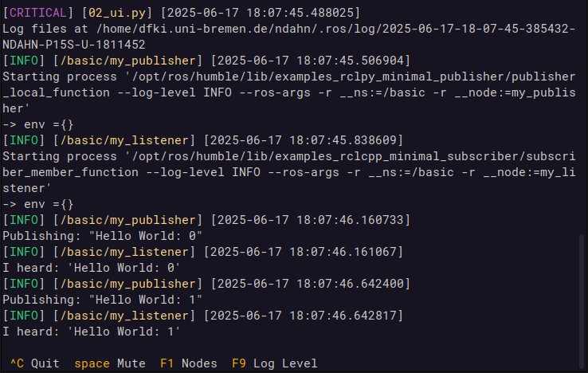

# Summary

Today, most robots use a middleware in order to manage and connect the various pieces of software they need for fulfilling their tasks. Over the last years, the most popular middleware - the Robot Operating System (ROS) - has received a complete overhaul and been released as ROS2. However, the reception so far has been mixed. While the code base has seen several important improvements, this reinvention has also come with severe downgrades in terms of user friendliness and usability. One of the biggest and most exposed offenders is the launch system, responsible for orchestrating the startup and execution of the robot's software components. The software presented in this paper - *better_launch* - is a complete replacement for the ROS2 launch system and solves several technical and usability issues. It is lightweight, intuitive, convenient, fully documented and comes with many examples.

# Statement of need

On one hand, being able to write launch files in python is a nice feature which does away with many of the limitations the old ROS1 xml launch files came with. On the other hand, the current implementation tries to use python as a declarative language, forcing users to dance around unintuitive constructs as none of the values and nodes exist yet at the time of execution. Aside from its wordiness and significant challenge to new users, it comes with several anti patterns and technical issues, too:
- execution order of actions is non-deterministic
- dynamic code execution (e.g. passing code as a string for later execution)
- resists linting as many arguments have to be passed as strings
- resists automated code analysis as actions don't have a unified way of exposing internals
- frequent zombie processes
- convoluted and obscure internals
- etc.

There are of course good reasons for the way the launch system has been implemented, at least on a superficial level. According to the design document, the intent is to treat launch files as "a description of what will happen" without executing anything. This is so that tools can "visualize and modify the launch description". The recently released @launchmap is able to do just that. However, given that users may define their own launch actions without a common way of inspecting them, it could be argued that even this use case is not well supported right now. There is also no good argument why the same couldn't be achieved using e.g. python's inspect module and/or a non-declarative syntax.

# Existing Remedies

The issues in user friendliness have led to the emergence of several packages that simplify writing launch files, e.g. @simple_launch and @launch_generator, while other packages like the popular @generate_parameter_library are dedicated to particular aspects of the launch process. However, in the end they all face the same issues mentioned above, as they just represent different ways of generating the launch descriptions.

# better_launch

In order to actually resolve these issues I have written *better_launch*, a complete and self-contained replacement for the ROS2 launch system with no dependencies on the existing facilities. Getting started with *better_launch* is easy as it is well documented and comes with examples for various common use cases. It enables developers to write simple and intuitive launch files using regular pythonic syntax (see example below). Crucially, it addresses the above issues as follows:

- Any actions taken in the launch files are executed immediately, allowing direct and meaningful interactions with nodes, topics and services as the launch process develops. This allows to e.g. adjust one node's parameters based on another node's published topics.
- Arguments to the launch file are "declared" in the form of function arguments which are passed as natural types, enabling common python syntax like if-else.
- *better_launch* launch files are fully compatible with the ROS2 launch system. This means they can be started through `ros2 launch`, include regular ROS2 launch files, and even get included from regular ROS2 launch files.
- The entire launch logic is contained within a single, fully documented package, examples included. Convenience functions exist for various common tasks like starting a `joint_state_publisher` or bridging Gazebo topics.
- *better_launch* comes with a replacement for `ros2 launch` called `bl`, which is both faster than its counterpart and provides additional features. For example, `bl` enables auto completion for launch parameters and uses the launch function's docstring to generate a `--help` text.
- To improve usability, *better_launch* reformats and colors terminal output by default. 
- Unless killed with SIGKILL, *better_launch* will not leave zombie processes behind. 
- *better_launch* provides an optional and unobtrusive **terminal UI** reminiscent of @rosmon, which can be used for stopping and restarting nodes, triggering life cycle transitions, list a node's subscribed topics, dynamically adjust the logging level, and more.

{height="90%"}

We consider *better_launch* mature enough for general use in research applications. It is under active development and can be downloaded for free from https://github.com/dfki-ric/better_launch. We hope that *better_launch* will advance the state of ROS2 in a meaningful way.

# Example

The ROS2 tutorials provide an [example launch file](https://docs.ros.org/en/jazzy/Tutorials/Intermediate/Launch/Using-Substitutions.html) for running a turtlebot simulation. This launch file creates a node, then calls one of its services and updates a parameter. Ironically, due to the asynchronous execution, the parameter update usually fails because the node has not come up yet. *better_launch* does not have this issue, and can in addition express the same launch file with only 28 instead of 73 lines - including documentation!

```python
#!/usr/bin/env python3
from better_launch import BetterLaunch, launch_this

@launch_this
def great_atuin(
    turtlesim_ns: str = "turtlesim1", 
    use_provided_red: bool = True, 
    new_background_r: int = 200,
):
    """ This docstring will also be used to create text for --help!"""
    bl = BetterLaunch()

    with bl.group(turtlesim_ns):
        turtle_node = bl.node(
            package="turtlesim",
            executable="turtlesim_node",
            name="sim",
            params={"background_r": 120},
        )

    bl.call_service(
        topic=f"/{turtlesim_ns}/spawn",
        service_type="turtlesim/srv/Spawn",
        request_args={"x": 2.0, "y": 2.0, "theta": 0.2},
    )

    if use_provided_red:
        turtle_node.is_ros2_connected(timeout=None)
        turtle_node.set_live_params({"background_r": new_background_r})
```

# References
